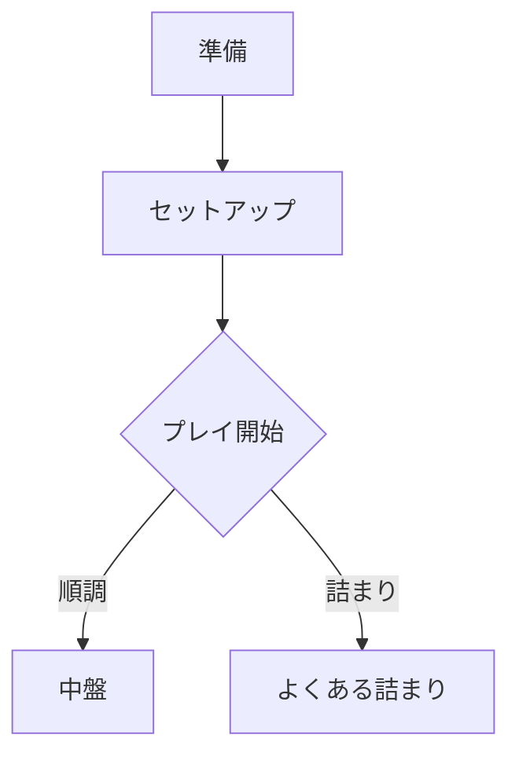

# Skill: Material for MkDocs UIパターン集（カード/ボタン/一覧ページ向け）

## 目的
Material for MkDocs の主要な表現機能（Features Showcase 相当）を、**「カード型カタログ（一覧→詳細）」の実装で直に使える形**に再編し、実装時に迷わない参照物にする。

対象読者：MkDocs + Material を使い、Markdown中心で UI を整えたい人（VS Code / Codex での反復実装を想定）。

参考元（機能の全体像）：MkDocs Material Features Showcase（Dentro de AI のデモページ）  
- https://dentro.de/ai/features/ （コンテンツ例の発想元）  
- 公式機能の詳細は Material for MkDocs docs を参照（各機能の仕様の最終確認先）  
  - https://squidfunk.github.io/mkdocs-material/  

---

## 使うとき（トリガー）
- トップを「カードのグリッド（カタログ）」にしたい
- 一覧カード内に「CTAボタン」「タグ」「短い説明」を置きたい
- タブ、注意枠（admonition）、ツールチップ、脚注、タスクリスト等を組み合わせたい
- Mermaid 図（フローチャート/シーケンス/円グラフ/マインドマップ/Git graph など）で説明を添えたい
- mkdocs.yml の `features:` や Markdown 拡張の “最低限のセット” を固めたい

## 使わないとき（非スコープ）
- Headless CMS/DB 連携や、検索インデックスの大改造（別設計）
- React/Vue等のSPA実装（別スタック）
- 画像の作成・編集（別工程）

---

## 最小構成（mkdocs.yml の考え方）
Features Showcase が示しているのは、「**テーマ機能 + Markdown拡張**」の組み合わせで表現力を上げる、という方針。

### 1) テーマ機能（例）
- ライト/ダーク切替
- カラーパレット（primary/accent）
- コードブロックのCopyボタン
- 検索サジェスト
- トップナビ
- パンくず/ナビ追跡
- 右サイドTOCの追従

※これらは `theme:` と `features:` で制御する。実際のキー名・可否は公式docsで確認する。

### 2) Markdown拡張（代表）
- `admonition`（注意枠）
- `pymdownx.details`（折りたたみ admonition）
- `pymdownx.superfences`（高度なコードブロック）
- `pymdownx.tabbed`（タブ）
- `pymdownx.tasklist`（タスク）
- `footnotes`（脚注）
- Mermaid / diagram 系（導入している場合）

---

## 実装チートシート（パターン別）

### A. カード型カタログ（グリッド + カード）
一覧ページで最も重要。Material の `grids` 記法（グリッド内でカード見せ）を中心に設計する。

#### 目的別レイアウト
- 「タイトル + 1行キャッチ + 2〜3行説明 + CTA」：情報密度が安定
- 「タグ/属性（人数・時間・難度）をメタ行で揃える」：一覧の比較がしやすい

#### 最小テンプレ（index.md 例）
> ここでは “記法の骨格” を示す。詳細なマークアップは公式 Grids docs で確定する。

```md
## 18xx タイトル一覧

::: grid
-   ::: card
    ### 18Chesapeake
    60–120分 / 3–6人 / 難度: 中

    短い要約（2〜3行で揃える）

    [サマリーを見る](./18chesapeake/){{ .md-button .md-button--primary }}
    :::

-   ::: card
    ### 1817
    120–240分 / 3–5人 / 難度: 高

    短い要約（2〜3行）

    [サマリーを見る](./1817/){{ .md-button }}
    :::
:::
```

**実務のコツ**
- カードの高さを揃えたい場合は、説明文の行数を制限し、メタ情報の形式を統一する。
- CTAは “primaryを乱発しない”。一覧は疲れるので、primaryは1〜2箇所/画面が目安。

---

### B. ボタン（CTA）と配置
Material はリンクを「ボタン風」にできる（クラス付与）。

```md
[サマリーを見る](./game-x/){{ .md-button .md-button--primary }}
[BGG](https://boardgamegeek.com/...){{ .md-button }}
```

**配置の定石**
- カード内：説明の直下に1つ（主CTA）。外部リンクは小さめ/セカンダリ扱い。
- 詳細ページ上部：主CTA（PDF/原文/関連）を水平に並べる。

---

### C. ツールチップ（補足を短く出す）
用語や略語に補足を付けたい時に有効。

```md
用語（?）[= tooltip](# "ここに短い補足")
```

※実際の記法・要件は導入拡張やテーマ機能に依存するため、Material docs の Tooltip 記法で確定する。

---

### D. Admonition（注意枠）+ 折りたたみ
「TL;DR」「注意」「FAQ」「Tips」などを揃えると、ページが読みやすくなる。

```md
!!! note "補足"
    ここに補足。

??? info "折りたたみ（詳細）"
    長い注意・前提条件など。
```

**使いどころ**
- ルールサマリー：例外や注意（「よくある誤読」）を admonition に寄せる
- 一覧ページ：過剰に使わない（詳細ページ向き）

---

### E. タブ（比較・複数版の並列）
「基本/例外」「初心者向け/経験者向け」「英語/日本語」などの切替に便利。

```md
=== "初心者向け"
    まずここだけ読めばOKな要点。

=== "詳細"
    例外・注記・補足。
```

---

### F. コードブロック（superfences / 注釈）
設定例（mkdocs.yml / CSS）などを見せる時の基本。

```md
```yaml
theme:
  name: material
```
```

※注釈付きコード（callout/ハイライト）等も可能。必要になった時点で公式の「Annotated code blocks」記法で確定する。

---

### G. タスクリスト（チェックリスト）
「やること」「レビュー観点」をページ末尾に置くと運用が回る。

```md
- [ ] ルール要点が3分で読める
- [ ] “例外” は admonition に隔離
- [ ] 外部リンク（BGG等）の更新日を記載
```

---

### H. 脚注（footnotes）
「根拠」「補足」「用語の出典」を散らさずに置ける。

```md
本文中の注釈。[^1]

[^1]: ここに補足。
```

---

### I. 表（テーブル）
属性（人数/時間/難度/要素）を整形する最短手段。

```md
| 属性 | 値 |
|---|---|
| 人数 | 3–6 |
| 時間 | 60–120分 |
| 特徴 | 株/線路/拡張 |
```

---

### J. 画像（配置・回り込み）
カードのサムネや、詳細ページの説明図。

- Markdown標準の画像埋め込みを基本にして、必要なら「寄せ/回り込み」を使う。
- 「テキストが上から回り込む」系は、サイトCSSと合わせて破綻しやすいので、ページテンプレでルール化する。

---

### K. 図表（Charts / Mermaid系）
Features Showcase では、フローチャート・シーケンス・円グラフ・マインドマップ・Git graph 等の例が並ぶ。

導入方針：
1) まず “フローチャート” だけ採用（運用が軽い）  
2) 次に “シーケンス” （手順説明に強い）  
3) 円グラフ等は「本当に必要なページ」に限定

例（Mermaidの骨格）：
```md

```

※Mermaid 設定（init/theme/セキュリティ）は mkdocs.yml とプラグイン設定次第なので、採用時に確定する。

---

## カタログサイト向け「トップページ」定番構成
1. 上部：サイトの目的（1〜2行） + 入口導線（ボタン2つ程度）
2. 次：タグ/属性別の入口（例：短時間/低人数/初学者向け）
3. 次：全タイトル（カードグリッド）
4. 下部：更新履歴（簡単なログ or blog）

---

## よくある失敗 → 回避策
- カード内の情報量がバラバラ → メタ行の形式を固定し、説明文を2〜3行で揃える
- 全カードが主張しすぎる（primary乱発） → primaryは最小限、hover/focusで差を付ける
- タブ/注意枠を使いすぎて読む順序が崩れる → “読む順” は本文、補足は admonition/脚注へ
- 図を増やしすぎる → フローチャートだけに絞る（必要になってから増やす）

---

## 依頼文の例（Codex向け）
- 「Material for MkDocsで、トップをカード型カタログにしたい。上の“最小テンプレ”を基に index.md と CSS 方針を作って」
- 「カード内にメタ行（人数/時間/難度）と CTA を揃えたい。揃えるルール案とサンプルを追加して」
- 「タブと admonition と脚注を使って、詳細ページのテンプレを作って」
